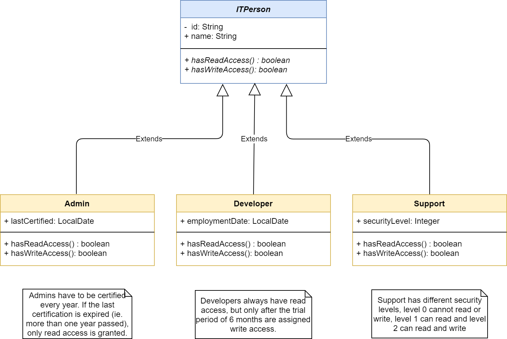

# SEA Checkpoint 1

**Hints**

- You can use resources and search engines of your choice.
- Try to solve the problems from memorizing what you learned first.
- If you get stuck, skip to the next step!
- Regardless of whether you finish, remember to commit everything and push at the end.

## Downloading and initializing of the project

### Work on your own Fork

Fork this repo and clone your copy of the repo to your local machine. **You will work on your copy during the exercise and use the Github repo URL to submit your solutions.**

> Tip: commit and push your changes after each exercise, to avoid unpleasant surprises

#### Import into IntelliJ

* Use "File / New / Project from Version Control" and use your forked Repo URL
* The IDE should recognize the Maven project and after the automatic setup you should be able to execute all unit tests.

## Exercises

##  Class diagram for IT-Crowd

The following diagram shows the associations between entities of the IT-Crowd, a group of IT-people employed at some company:

* All members of the IT-Crowd are `ITPerson`
* All `ITPerson` have to implement `hasReadAccess` and `hasWriteAccess` methods which return true or false.
* `Admin` are `ITPerson` with Read and Write access to Resources, if they are certified, ie. the `lastCertified` date is less than one year ago.
* `Developer` are `ITPerson` with Read access always, but Write access only after their trial period of 6 months, ie. the `employmentDate` is more than 6 months ago.
* `Support` are `ITPerson` with different levels of access, `level` 0 is no access, `level` 1 is Read access, `level` 2 is Write access.

###  Check Access Rights

* Look at the currently implemented classes (start with `dev.wilders.ITPerson`) and understand the structure.  
* The classes are already partly implemented, but their `hasReadAccess` and `hasWriteAccess` methods always return false.  
* You have to adjust those methods for `Admin`, `Developer` and `Support` to return the correct values according to the rules specified above.

If the implementation is correct, all tests in unit test class `CheckITPersonAccessTest` should pass.

### Repairing Names

Due to some import error, the names of the whole IT-Crowd has been corrupted. The names now have underscores "_" instead of Spaces. See `RepairCrowdNamesTest` for details.

* You have to repair the name, split the name in two at "_" and set the Name again correctly with Forename+" "+Lastname

If your implementation is correct, all tests in unit test class `RepairCrowdNamesTest` should pass.

### Generifying the Crowd

We can store `ITPerson` in `ITPersonStorage`, see `StoringTheCrowdTest`. However, this is implemented in a not generic way.
To be sure that our storage really stores `ITPerson`, we want to ensure that we can create a List with:

`List<ITPerson> itcrowd = new ArrayList<>();`

and can only add `ITPerson` or subclasses of it.
See `ITPersonStorage` and create a new class `GenericStorage`, which can be generified with `ITPerson`, so that this is possible:

`List<ITPerson> itcrowd = new ArrayList<>();`

**Bonus**: Add another class `GenericITPersonStorage`, which restricts its usage for `ITPerson` and its subclasses.

### Testing

When you change implementation parts, always make sure the tests still pass.

## Quiz

You will find a `quiz.txt`  file at the root of your local repository.

Answer the questions at the answer ("A:") lines.

> Try to answer without any help from the Internet!

## Finalization

Commit the changes made to your local branch; and push everything to your forked Repo.

Post the URL of your Repo as a direct message to your trainer in Rocket Chat